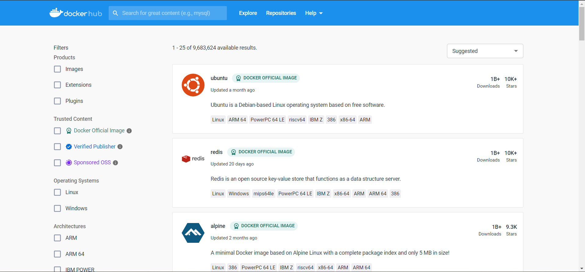
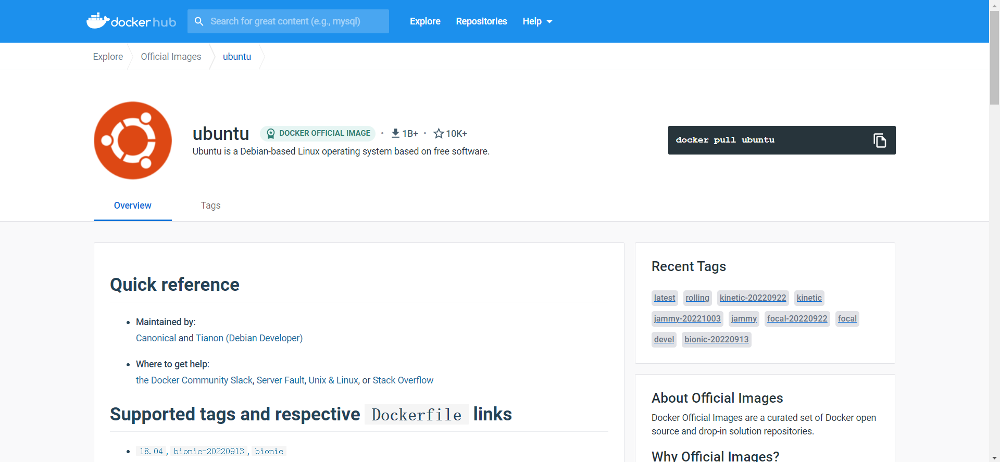

# LMP eBPF Store Design

## 1. 项目背景

### 1.1. 关于 LMP 项目

- 面向 ePF 初学者和爱好者，提供 eBPF 学习资料、程序/项目案例，构建 eBPF 学习社区
- 成为 eBPF 工具集散地，我们相信每一位 eBPF 初学者和爱好者都有无限的创造力
- 孵化 eBPF 想法、相关工具、项目

个人感觉 LMP 当前可能存在的一些问题或痛点：

- 对于初学者：Supermarket 里面每个子项目的文档都是独立的，目前还没有很好的整合起来；进行查找、搜索、索引很困难；
- 对于 eBPF 工具的开发者：存在非常多而且复杂的用户态可视化、展示方案，有许多套系统提供可视化的实现并且有多种语言混合，缺乏展示标准、难以进行可视化的整合；
- 对于贡献者：作为开源项目，缺少一个提供贡献的指导手册，虽然参与开源的成本较低（把项目上传就行），但是项目的复杂度、混乱度可能会随之上升；

### 1.2. 关于 eBPF 生态

现有的 eBPF 生态可能有存在两个方面的问题：

1. 一方面，对于新手而言，搭建和开发 ebpf 程序是一个门槛比较高、比较复杂的工作，必须同时关注内核态和用户态两个方面的交互和信息处理
2. 另一方面，个人编写的 ebpf 程序很难不通过 review 直接添加到 bcc 这样的大型的工具集中，使用或者集成个人开发者编写的 ebpf 程序也是一个很困难工作:

   - 它们可能使用多种用户态语言开发（go，rust，c/cpp 等等），有各种各样不同的接口;
   - 没有编译好的二进制程序，必须自己配置环境和编译才能使用；
   - 没办法很轻松以插件的方式集成到大型的可观测性或其他系统中，一般必须修改代码并重新编译整个可观测性的框架然后部署上线，才能更新其中的 bpf 探针；

总而言之：eBPF 缺少对于新手友好的开发方案，缺少一个 eBPF 工具通用的分发和托管平台，类似于 github 或者 docker hub。

## 2. 项目目标

基于上述的背景，我们希望有如下的两个部分：

1. 提供一个通用、规范化的 eBPF 程序/应用插件/工具的托管平台或应用商店，以及包管理器，可以在本地一行命令拉下来即可启动，不需要配置管理环境和重新编译并且通过 exporter 获得可视化信息；
2. 提供前端界面，提供对 LMP 里面所有 eBPF 工具的介绍和索引，帮助其他人检索和查找 eBPF 程序；

规范化的 eBPF 程序应当具有如下特征：

- `可移植`：让 eBPF 工具和应用完全平台/架构无关、可移植，不需要进行重新编译即可以跨平台/跨架构分发，不局限于内核版本，使用者本地无需任何 eBPF 相关环境配置；
- `隔离性`： eBPF 程序的加载和执行、以及用户态的数据处理流程应安全可靠；可以在大型的应用中作为可观测性插件使用，不会影响其他项目本身；
- `跨语言`：允许各种背景的开发人员（C、Go、Rust、Java、TypeScript 等）用他们选择的语言编写 eBPF 的用户态程序，而不需要学习新的语言；
- `轻量级`：包的数量和大小尽量小，启动速度尽可能快，本地安装的二进制尽可能小，不需要其他依赖；

包管理器是一个命令行工具，前端是一个网页，二者可以完全独立运行，不存在依赖关系。只是前端界面中有命令行工具的相关介绍文档，以及运行 eBPF 程序的一行命令。

对于编写 eBPF 代码的新手来说，应该可以屏蔽底层的实现方式，用户态如果需要编写一些代码的话，也应当是用他们熟悉的语言，不需要了解底层的编译流程。

### 项目成果

1. 一个或一些命令行工具，作为包管理器、编译和运行 eBPF 程序的工具；用来简化 eBPF 程序的分发、使用，和新手的编写过程；
2. 一个网页，作为前端界面; 用来解决 LMP 的问题，同时用来搜索；
3. 一个服务端，用来发布和下载编译好的 eBPF 程序; 用来托管 eBPF 程序；

## 3. User Case

### 3.1. 角色 1：普通用户/user

首先，我们有一个开发人员的用例，他想使用 ebpf 二进制文件或者程序，但不知道如何/在哪里找到它:

直接运行

```console
$ lmp run opensnoop                                                     # 使用一个名字直接跑起来，如果本地没有，就去网上对应的 repo 下载
running and waiting for the ebpf events from perf event...
$ lmp run opensnoop:latest                                              # 使用一个名字和版本号
running and waiting for the ebpf events from perf event...
$ lmp run https://github.com/ebpf-io/raw/master/examples/opensnoop/app.wasm # 使用一个http API
running and waiting for the ebpf events from perf event...
$ lmp run ./opensnoop.bpf                                               # 使用一个本地路径
running and waiting for the ebpf events from perf event...
$ lmp run sigsnoop -h                                                  # 带参数
Usage: sigsnoop [-h] [-x] [-k] [-n] [-p PID] [-s SIGNAL]
Trace standard and real-time signals.


    -h, --help  show this help message and exit
    -x, --failed  failed signals only
    -k, --killed  kill only
    -p, --pid=<int>  target pid
    -s, --signal=<int>  target signal
```

run 命令实际上包含了 pull 命令，如果本地没有对应的 ebpf 文件，就会去网上下载，如果本地有，就直接使用本地的：

```console
$ lmp pull opensnoop
$ lmp run opensnoop
running and waiting for the ebpf events from perf event...
```

或者他/她也可以在网页上进行搜索，然后直接下载（具体查看下章）.

可以切换源，比如从 github 切换到 lmp 静态服务器:

```console
LMP_REPOSITORY=https://lmp.ebpf.io lmp run opensnoop # 从 lmp 静态服务器下载，前缀路径改为 https://lmp.ebpf.io
```

`lmp run opensnoop` 实际上等效为 `lmp run https://github.com/ebpf-io/raw/master/examples/opensnoop/app.wasm`。
`lmp run opensnoop:v1` 实际上等效为 `lmp run https://github.com/ebpf-io/raw/master/examples/tags/v1/app.wasm`。

### 3.2. 角色 2：通用 ebpf 数据文件发布者/ebpf developer

我们的第二个角色是一个开发人员，他想要创建一个通用 eBPF/WASM 预编译二进制，并在任何机器和操作系统上分发它，并且动态加载运行。这对于命令行工具或者可以直接在 Shell 中运行的任何东西都很有用，也可以作为大型项目的插件使用。

生成 ebpf 数据文件

```bash
$ lmp init opensnoop  # 生成一个项目模板
init project opensnoop success.
$ cd opensnoop  # 会创建一个新的目录
$ ls # 生成如下一些文件
opensnoop.bpf.c opensnoop.bpf.h README.md config.json .gitignore
$ docker run -it -v `pwd`/:/src/ yunwei37/ebpm:latest # 构建内核态程序
$ ls # 生成如下一些文件，package.json 是编译生成的产物
opensnoop.bpf.c opensnoop.bpf.h README.md config.json package.json .gitignore
$ docker run -it -v `pwd`/:/src/ yunwei37/ebpm:latest gen-wasm-skel # 生成 wasm 用户态项目模板
make
  GENERATE_PACKAGE_JSON
  GEN-WASM-SKEL
$ ls # 生成如下一些文件
app.c eunomia-include ewasm-skel.h package.json README.md  opensnoop.bpf.c  opensnoop.bpf.h
$ docker run -it -v `pwd`/:/src/ yunwei37/ebpm:latest build-wasm
make
  GENERATE_PACKAGE_JSON
  BUILD-WASM
build app.wasm success
$ sudo ./ecli run app.wasm -h
Usage: opensnoop [-h] [-x] [-k] [-n] [-p PID]
```

我们提供的是 C 语言版本的 WASM 开发框架，它包含如下这些文件：

- ewasm-skel.h：用户态 WebAssembly 开发框架的头文件，包含了预编译的 eBPF 程序字节码，和 eBPF 程序框架辅助信息，用来动态加载；
- eunomia-include：一些 header-only 的库函数和辅助文件，用来辅助开发；
- app.c：用户态 WebAssembly 程序的主要代码，包含了 eBPF 程序的主要逻辑，以及 eBPF 程序的数据处理流程。

其中 app.c 中用户需要编写的代码应该是纯粹的、正常的 C 语言代码，不需要有任何关于底层 WASM 实现的知识。可以在完全对 WASM 不了解的情况下，使用我们提供的框架进行开发。

配置文件模板：

```json
{
  "name": "opensnoop",
  "version": "0.1.0",
  "author": "John Doe",
  "description": "This is a bootstrap template for a ebpm BPF program."
}
```

这四个是必填，剩下是可选（扩展），比如可以引入依赖，打 tag 就是记录 git tag：

```json
{
  "name": "opensnoop",
  "version": "0.1.0",
  "author": "John Doe",
  "description": "This is a bootstrap template for a ebpm BPF program.",
  "dependencies": {
    "sigsnoop": {
      "version": "0.1.0",
      "url": "https://github.com/ebpf-io/raw/master/examples/sigsnoop/app.wasm"
    }
  }
}
```

发布 ebpf 数据文件（可选：可以不在命令行和网站实现相关内容，使用 Github 等等代码托管平台的 PR 和 CI 完成添加项目）

```bash
$ lmp login
success login
$ lmp build opensnoop:latest
success
$ lmp publish
success
$ lmp push opensnoop:latest # 推送新的文件：
success
```

### 3.3. 角色 3：其他程序的开发者/ebpf 程序使用者/other developers

考虑利用 eBPF 程序包去完成其他事情的人，例如 `pip install opensnoop` 就能获得对应的功能

TODO: 未来的目标，现在先不考虑

### 3.4. 一些其他思考

所有这些用例促使我们重新思考包管理器的当前全景，以及我们如何创建一个只关注 ebpf 的包管理器，它将统一以下原则:

- 它应该使发布、下载和使用 ebpf 模块变得容易；
- 它应该支持在 ebpf 之上定义命令的简单方法；
- 它应该允许不同的 ABI：甚至未来的新 ABI。
- 它应该可以嵌入到任何语言生态中(Python、PHP、Ruby、JS…)，而不会强迫一个生态进入另一个生态

其他一些需要注意的点

- 需要注意循环依赖；
- 直接从 GitHub，BitBucket，GitLab，托管 Git 和 HTTP 中提取依赖项
- 最好有完全可重现的构建和依赖性解析
- 完全分散 - 没有中央服务器或发布过程
- 私有和公共依赖，以避免“依赖地狱”
- 完全支持语义版本控制
- 通过直接依赖于 Git 分支来快速移动，但是以受控方式
- 版本等效性检查以减少依赖性冲突
- 可以离线工作

## 4. 前端网页原型

这里给出了一个简单的前端网页的原型。

### 4.1. 首页和项目列表页面



把 docker 换成 lmp 或者 ebpf，就是我们的首页了。

### 4.2. 项目详情页面



Overview 是 README.md 自动生成的内容。

### 4.3. 个人主页和登录界面

这部分暂时可以忽略

## 5. 技术选型

### 5.1. 结合 eBPF 和 WASM

一般来说，一个完整的 eBPF 应用程序分为用户空间程序和内核程序两部分：

- 用户空间程序负责加载 BPF 字节码至内核，或负责读取内核回传的统计信息或者事件详情，进行相关的数据处理和控制；
- 内核中的 BPF 字节码负责在内核中执行特定事件，如需要也会将执行的结果通过 maps 或者 perf-event 事件发送至用户空间

用户态程序可以在加载 eBPF 程序前控制一些 eBPF 程序的参数和变量，以及挂载点；也可以通过 map 等等方式进行用户态和内核态之间的双向通信。那么，如果将用户态的所有控制和数据处理逻辑全部移到 WASM 虚拟机中，通过 WASM module 打包和分发 eBPF 字节码，同时在 WASM 虚拟机内部完成整个 eBPF 程序的加载和执行，也许我们就可以将二者的优势结合起来，让任意 eBPF 程序能有如下特性：

- `可移植`：让 eBPF 工具和应用完全平台无关、可移植，不需要进行重新编译即可以跨平台分发；
- `隔离性`：借助 WASM 的可靠性和隔离性，让 eBPF 程序的加载和执行、以及用户态的数据处理流程更加安全可靠；事实上一个 eBPF 应用的用户态控制代码通常远远多于内核态；
- `包管理`：借助 WASM 的生态和工具链，完成 eBPF 程序或工具的分发、管理、加载等工作，目前 eBPF 程序或工具生态可能缺乏一个通用的包管理或插件管理系统；
- `跨语言`：目前 eBPF 程序由多种用户态语言开发（如 Go\Rust\C\C++\Python 等），超过 30 种编程语言可以被编译成 WebAssembly 模块，允许各种背景的开发人员（C、Go、Rust、Java、TypeScript 等）用他们选择的语言编写 eBPF 的用户态程序，而不需要学习新的语言；
- `敏捷性`：对于大型的 eBPF 应用程序，可以使用 WASM 作为插件扩展平台：扩展程序可以在运行时直接从控制平面交付和重新加载。这不仅意味着每个人都可以使用官方和未经修改的应用程序来加载自定义扩展，而且任何 eBPF 程序的错误修复和/或更新都可以在运行时推送和/或测试，而不需要更新和/或重新部署一个新的二进制；
- `轻量级`：WebAssembly 微服务消耗 1% 的资源，与 Linux 容器应用相比，冷启动的时间是 1%：我们也许可以借此实现 eBPF as a service，让 eBPF 程序的加载和执行变得更加轻量级、快速、简便易行；

我们目前已经有一个将 eBPF 和 WASM 结合起来的，可行性验证性质的项目，之后可能会在这个基础上继续构建：eunomia-bpf 是 `eBPF 技术探索 SIG` [3] [5] 中发起并孵化的项目，目前也已经在 [github](https://github.com/eunomia-bpf/eunomia-bpf) [4] 上开源。eunomia-bpf 是一个 eBPF 程序的轻量级开发加载框架，包含了一个用户态动态加载框架/运行时库，以及一个简单的编译工具链。eunomia-bpf 的目标是让 eBPF 程序的开发、加载和执行变得更加简单、轻量级、快速、可靠、安全、可移植、敏捷、跨语言、可扩展等。只需要编写 eBPF 程序的内核态代码，以 JSON 的形式分发和使用编译后的 eBPF 代码，就可以跨平台、跨内核版本自动获得上报的事件。也可以以 WASM module 的方式，将内核态和用户态的代码一同进行分发，在目标机器上动态加载运行。

WASM 的所有复杂度都会被隐藏起来，实际上用户可以不知道自己开发的用户态程序会被编译为 WASM 模块并进行分发。

### 包管理器命令行工具

- 复用 ecli 和 docker 的成果，只需要关注如何获得正确的 ebpf 程序的下载地址，然后把它交给 ecli 就行。编译模板生成也是一样，底层会去调用 ecli 的相关命令。
- 可以先不关注登录和上传的过程，采用 Github PR 或者 gitee PR 的形式提交新的 eBPF 程序。

之后需要完成的：

- 上传 ebpf 程序的过程
- 登录注册、使用

### 前端网页

目前的 demo 是采用 jekyll 框架实现，对于原型系统，实际上只需要一个静态的网页就可以了。从实现的角度来说，原型系统可以直接复用博客模板/主题的形式，只需要把博客模板/主题中的文章部分替换成 eBPF 程序的列表，把文章的内容替换成 eBPF 程序的详情页就可以了。

- <https://github.com/jeffreytse/jekyll-theme-yat>
- <http://jekyllthemes.org/themes/textalic/>

之后需要完成的：

- 登录注册、使用
- 个人账号名下的项目管理

### 一个服务端，用来发布和下载编译好的 eBPF 程序

最简单的版本：采用 Github CI 或者脚本进行部署，到静态文件服务器上，用 url 访问。忽略 eBPF 程序版本问题，默认使用最新的版本。

之后需要考虑的：

- eBPF 程序版本；
- ？？？

## 6. 开发代价预估

第一阶段：一个简单的 demo

- 服务端静态文件服务器部署好了，只需要更新一下脚本到 LMP 里面就行， eunomia-bpf 已经有现有的实现（预计两三小时就可以为所有项目生成 WASM 和 JSON 两种程序包）
- 命令行工具复用一下 ecli 的成果，只需要正确从 LMP 上面下载 eBPF 程序，然后把它交给 ecli 就行（预计两三小时或者一个人天就可以完成）
- 前端：找个好看的博客模板，最好一行代码都不用写（预计一人天）

第二阶段：需要有更详细的设计文档
